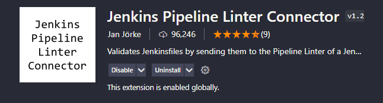
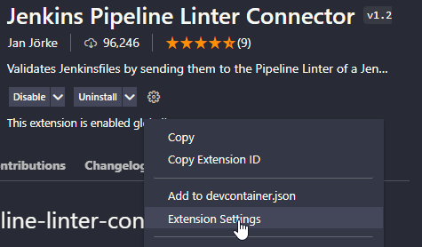
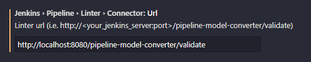
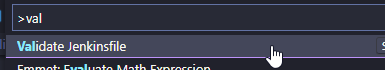

# jenkins-image-for-pipeline-linting
Jenkins docker image for usage with **Jenkins Pipeline Linter Plugin** for Visual Studio Code and IntelliJ IDEs. It can also be used **via command line**

This image has no setup required, ready to use as soon as it is run, plugins are pre-installed, all security and first type setup wizzard disabled, ready to take queries from the extension or the command line.

## Linting with Visual Studio Code
Pull the image from Dockerhub using:
```
docker pull paulohgodinho/jenkins-for-pipeline-linting
```

Run the container with the 8080 port exposed to the host system
```
docker run -p 8080:8080 paulohgodinho/jenkins-for-pipeline-linting
```

Install the **Jenkins Pipeline Linter Connector** plugin for Visual Studio Code



Go to the extension settings



Input the running Jenkins container URL with port, and the path `/pipeline-model-converter/validate` at the end.



Run the linter by pressing *CTRL+SHIFT+P* and searchign for *Validate Jenkinsfile*



## Linting via Command Line
You can use Bash and Powershell to manually verify your Pipeline

**Bash:**
```
curl -F "jenkinsfile=< mypipeline.jenkinsfile" http://localhost:8080/ipeline-model-converter/validate
```
**Powershell:**
```
Invoke-RestMethod -Method Post -Form @{jenkinsfile=$(Get-Content .\mypipeline.jenkinsfile -raw)} -Uri http://localhost:8080/pipeline-model-converter/validate
```


## Issue: The docker image does not contain the Jenkins Pipeline plugin I am using
You can add your plugin id to *plugins.txt* and build your own image. If you belive the plugin should be in this distributed image please make a PR or message me, I am happy to add more.
